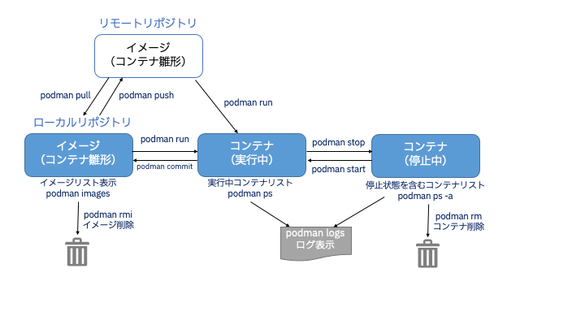

# Podman Desktop のインストールとPodmanコマンドの使い方

## Podman Desktop for Windows のインストール
**公式ページ**：[Windowsインストーラを使って Podman Desktop をインストールする方法](https://podman-desktop.io/docs/Installation/windows-install)

以下、軽く解説(更新されているかもしれないので、インストールがうまくいかない場合は最新内容をチェックして下さい)

* とりあえずインストールしたい人
  * [インストーラダウンロードページ](https://podman-desktop.io/downloads/windows)から「Download Now」でインストーラをダウンロード
  * インストーラを実行、全てデフォルトのまま「はい」で進めてOK
* インストールせずに実行したい人
  * [インストーラダウンロードページ](https://podman-desktop.io/downloads/windows)で「Windows portable executable」をクリックして、exe本体をダウンロード
* サイレントインストールしたい人(管理者がユーザに黙ってインストールさせたりとか)
  * https://podman-desktop.io/docs/Installation/windows-install/installing-podman-desktop-silently-with-the-windows-installer)
* パッケージマネージャを導入している人
  * `choco install podman-desktop`
  * `scoop bucket add extras　&& scoop install podman-desktop`
  * `winget install -e --id RedHat.Podman-Desktop`
* インターネットが使えない制限された環境の人
  * https://podman-desktop.io/docs/Installation/windows-install/installing-podman-desktop-and-podman-in-a-restricted-environment
  * インストール時にダウンロードするライブラリ等一式含まれている版。

### Podman のインストール
Podman DesktopはあくまでGUI。Podman engineの導入が別途必要です。
Windowsの場合、Podman engine自体は仮想マシン上のLinuxで動作させる必要があります。

1. PowerShell画面を管理者権限で起動
2. WSLをLinux(デフォルトUbuntu)抜きでインストール
   * wsl --install --no-distribution
3. Podman Desktopで「Install」ボタンクリック
4. Podmanインストーラは全てデフォルトのままインストールしてしまう
5. 「Initialize Podman」ボタンクリック。
   * `podman machine init && podman machine start` をおこなってくれている 

## Podman Desktop for mac のインストール
1. Podman Desktop ARM版（DMG）のダウンロードとAppへのコピー
   * https://podman-desktop.io/downloads/macos からARM版のリンクをクリック
2. Podman Installボタン実行
3. Mac画面上部のPodman常駐クリックメニューのdashboardで開いた画面の右側のinstallボタンをクリック
4. MacのTerminal起動
5. Homebrewのインストール
   * /bin/bash -c "$(curl -fsSL https://raw.githubusercontent.com/Homebrew/install/HEAD/install.sh)"
6. brew install podmanの実行
7. podman machine initの実行
8. podman machine startの実行

## Podman 動作確認
### Hello World
```
podman run hello-world
```

以下が出力されればOKです。
```
!... Hello Podman World ...!

         .--"--.
       / -     - \
      / (O)   (O) \
   ~~~| -=(,Y,)=- |
    .---. /`  \   |~~
 ~/  o  o \~~~~.----. ~~
  | =(X)= |~  / (O (O) \
   ~~~~~~~  ~| =(Y_)=-  |
  ~~~~    ~~~|   U      |~~
```
Quay.ioからhelloという名前のコンテナを持ってきて(pull)、自分のpodman engine環境で実行した結果です。

podmanのもぐらくんたちを素敵なアスキーアートで表現していますね。

### podman コマンド実行
いろいろ実行してみましょう。



#### 1. コンテナ実行前の事前ダウンロード(podman pull)

コンテナイメージをコンテナレジストリからダウンロードします。

Publicなコンテナレジストリはいくつかありますが、有名なDockerのデフォルトレジストリである「docker.io」から「nginx」というコンテナを、Red HatのコンテナレジストリSaaSである「Quay.io」から「busybox」というコンテナイメージをダウンロードしてみましょう。

```
podman pull docker.io/nginx
```

<details>
<summary>実行例</summary>

 ```
$ podman pull docker.io/nginx
Trying to pull docker.io/library/nginx:latest...
Getting image source signatures
Copying blob sha256:75576236abf5959ff23b741ed8c4786e244155b9265db5e6ecda9d8261de529f
Copying blob sha256:26c5c85e47da3022f1bdb9a112103646c5c29517d757e95426f16e4bd9533405
Copying blob sha256:4f3256bdf66bf00bcec08043e67a80981428f0e0de12f963eac3c753b14d101d
Copying blob sha256:2019c71d56550b97ce01e0b6ef8e971fec705186f2927d2cb109ac3e18edb0ac
Copying blob sha256:8c767bdbc9aedd4bbf276c6f28aad18251cceacb768967c5702974ae1eac23cd
Copying blob sha256:78e14bb05fd35b58587cd0c5ca2c2eb12b15031633ec30daa21c0ea3d2bb2a15
Copying config sha256:6efc10a0510f143a90b69dc564a914574973223e88418d65c1f8809e08dc0a1f
Writing manifest to image destination
Storing signatures
6efc10a0510f143a90b69dc564a914574973223e88418d65c1f8809e08dc0a1f
```
</details>

```
podman pull quay.io/quay/busybox
```

<details>
<summary>実行例</summary>

 ```
$ podman pull quay.io/quay/busybox
Trying to pull quay.io/quay/busybox:latest...
Getting image source signatures
Copying blob sha256:ee780d08a5b4de5192a526d422987f451d9a065e6da42aefe8c3b20023a250c7
Copying blob sha256:9c075fe2c773108d2fe2c18ea170548b0ee30ef4e5e072d746e3f934e788b734
Copying config sha256:e3121c769e3948dd4a7e1764f4841d044efcfda47804a5384597b7b117054c4c
Writing manifest to image destination
Storing signatures
e3121c769e3948dd4a7e1764f4841d044efcfda47804a5384597b7b117054c4c
```
</details>

ダウンロードはこれだけです。簡単ですね。

#### 2. ダウンロードしたコンテナイメージの確認(podman images)

ダウンロード(pull)したコンテナイメージを一覧表示してみましょう。

```
podman images
```

<details>
<summary>実行例</summary>

 ```
$ podman images
REPOSITORY               TAG         IMAGE ID      CREATED      SIZE
docker.io/library/nginx  latest      6efc10a0510f  8 days ago   147 MB
quay.io/quay/busybox     latest      e3121c769e39  2 years ago  1.45 MB
```
</details>

ダウンロード(pull)したイメージがリストアップされていますね。

#### 3. コンテナの実行(podman run)

では、ダウンロード(pull)したコンテナを実行してみましょう。
```
podman run -it --name test1 busybox sh
```

* どういう状態?: 
  * busyboxコンテナをtest1という名前で作成、(-itオプションで)仮想端末(tty)にインタラクティブ接続し、コマンド実行可能な状態になっています。ls, pwd, echo コマンドなどお試しください。
* 停止：
  * `exit`と入力しEnterしてください。

#### 4. コンテナの状態の確認表示(podman ps)
実行中コンテナの状態を確認します。ps はLinuxのpsコマンドと同じく、実行中のプロセス(この場合、コンテナ)を表示します。

```
podman ps
```

<details open>
<summary>実行例</summary>

 ```
$ podman ps
CONTAINER ID  IMAGE       COMMAND     CREATED     STATUS      PORTS       NAMES
```
</details>

現在実行中のコンテナが1つもないことがわかります。

続けて、停止状態を含めたコンテナの状態を確認します。 -aオプションをつけてpsコマンドを実行すると、停止中を含めた全コンテナが表示されます。

```
podman ps -a
```

<details open>
<summary>実行例</summary>

```
$ podman ps -a
CONTAINER ID  IMAGE                        COMMAND     CREATED     STATUS                 PORTS       NAMES
b7298b05638a  quay.io/quay/busybox:latest  sh          3 days ago  Exited (0) 3 days ago              test1
```
</details>

先ほど起動したbusyboxコンテナが停止(Exit)状態にあることがわかります。

#### 5. デーモンコンテナの実行(podman run)

先ほどのコンテナは、`exit`すると同時に停止してしまいました。
通常、コンテナは処理を実行するとフォアグラウンドで実行され、ユーザがexitコマンドなどで停止させると、実際に停止してしまいます。

それだとwebサーバのような常時起動しておきたいコンテナは困ります。

その場合、-dオプション (デタッチドモード, daemonではないんだね…)でバックグラウンド起動させることができます。早速nginxというwebサーバをバックグラウンド実行してみましょう。

```
podman run -d --name docker-nginx -p 8080:80 docker.io/nginx
```

<details open>
<summary>実行例</summary>

```
$ podman run -d --name docker-nginx -p 8080:80 docker.io/nginx
97c59775a1fa10cf1dfee053a9293b2c006dd625ac16ca7c40ee3db1ac832618
```
</details>
 
これは、8080ポートでnginxというWebサーバが起動しhttpリクエストを8080ポートで待っている状態です。
ブラウザで　http://localhost:8080 にアクセスしてください。nginxのデフォルトページが表示されます。

<details>
<summary>http://localhost:8080　へのアクセス例</summary>

```
$ curl http://localhost:8080
<!DOCTYPE html>
<html>
<head>
<title>Welcome to nginx!</title>
<style>
html { color-scheme: light dark; }
body { width: 35em; margin: 0 auto;
font-family: Tahoma, Verdana, Arial, sans-serif; }
</style>
</head>
<body>
<h1>Welcome to nginx!</h1>
<p>If you see this page, the nginx web server is successfully installed and
working. Further configuration is required.</p>

<p>For online documentation and support please refer to
<a href="http://nginx.org/">nginx.org</a>.<br/>
Commercial support is available at
<a href="http://nginx.com/">nginx.com</a>.</p>

<p><em>Thank you for using nginx.</em></p>
</body>
</html>
```
</details>

では、コンテナが起動状態かどうか確認してみましょう。podman ps を実行します。
 
```
podman ps
```

<details open>
<summary>実行例</summary>

 ```
$ podman ps
CONTAINER ID  IMAGE                           COMMAND               CREATED     STATUS         PORTS             NAMES
97c59775a1fa  docker.io/library/nginx:latest  nginx -g daemon o...  3 days ago  Up 3 days ago  0.0.0.0:0->0/tcp  docker-nginx
```
</details>


namesがdocker-nginxのコンテナが表示されています。
docker-nginxが起動中ということです。
もう一度ブラウザで　http://localhost:8080 にアクセスしてください。やはりnginxのデフォルトページが表示されます。

#### 6. ログの確認(podman logs)

コンテナのログを確認できます。

```
podman logs docker-nginx
```

このログは、標準出力(stdout)と標準エラー(stderr)へ書き出されたデータです。
Linuxの`tail -f`と同様に、-fオプションを付けることで稼働しているコンテナのログをリアルタイムに確認できます。

以下を実行したら、もう一度ブラウザで　http://localhost:8080 にアクセスしてみてください。

```
podman logs -f docker-nginx
```

ログにアクセスログが出ましたか？ 出ない方はブラウザをリロードしてみてください。

#### 7. コンテナの停止(podman stop / podman kill)

docker-nginxを停止しましょう。

```
podman stop docker-nginx
```

stopコマンドを実行したら、コンテナが停止していることを確認します。

```
podman ps -a
```

<details>
<summary>実行例</summary>

```
$ podman stop docker-nginx
docker-nginx
$ podman ps -a
CONTAINER ID  IMAGE                           COMMAND               CREATED     STATUS                 PORTS             NAMES
b7298b05638a  quay.io/quay/busybox:latest     sh                    3 days ago  Exited (0) 3 days ago                    test1
97c59775a1fa  docker.io/library/nginx:latest  nginx -g daemon o...  3 days ago  Exited (0) 3 days ago  0.0.0.0:0->0/tcp  docker-nginx
```

</details>

docker-nginxコンテナのSTATUSがExited(停止)となっています。つまり、停止させることができました。

ちなみに、podman stopと同じくコンテナプロセスを停止する役割としてpodman killがあります。
podman stopはSIGTERM(プロセス通常停止)でコンテナプロセスを停止しますが、podman kill は SIGKILL(強制停止)でプロセスを停止しています。
通常はpodman stopでプロセスを停止し、それで止まらない場合、異常時などにkillを使うようにしましょう。

#### 8. コンテナの起動(podman start)

止めた docker-nginx コンテナを起動します。

```
podman start docker-nginx
```

起動しているか確認します。

```
podman ps -a
```

<details>
<summary>実行例</summary>

```
$ podman ps -a
CONTAINER ID  IMAGE                           COMMAND               CREATED     STATUS                 PORTS             NAMES
b7298b05638a  quay.io/quay/busybox:latest     sh                    3 days ago  Exited (0) 3 days ago                    test1
97c59775a1fa  docker.io/library/nginx:latest  nginx -g daemon o...  3 days ago  Up 3 days ago          0.0.0.0:0->0/tcp  docker-nginx
```

</details>

docker-nginxコンテナのSTATUSがUp(起動)になっています。つまり、起動できました。

もう一度ブラウザで　http://localhost:8080 にアクセスしてください。nginxのデフォルトページが表示されます。

#### 9. コンテナの削除(podman rm)

使わないコンテナを削除します。

```
podman rm docker-nginx
```

<details open>
<summary>実行例</summary>

```
$ podman rm docker-nginx
Error: cannot remove container 97c59775a1fa10cf1dfee053a9293b2c006dd625ac16ca7c40ee3db1ac832618 as it is running - running or paused containers cannot be removed without force: container state improper
```

</details>


エラーが表示されました。起動中のコンテナは、一度停止してから削除できます。
(Linuxのrmコマンドと同じく、**-f** オプションで強制的に削除可能です)

では、すでに止まっている他のコンテナを削除しましょう。busyboxコンテナは停止状態です。このコンテナの名前はtest1と名付けていました。

```
podman rm test1
```

```
podman ps -a
```

<details open>
<summary>実行例</summary>

```
$ podman ps -a
CONTAINER ID  IMAGE                           COMMAND               CREATED     STATUS         PORTS             NAMES
97c59775a1fa  docker.io/library/nginx:latest  nginx -g daemon o...  3 days ago  Up 3 days ago  0.0.0.0:0->0/tcp  docker-nginx
```

</details>

リストから test1 コンテナ(busybox)が消えました。

#### 10. ローカルリポジトリからコンテナイメージの削除(podman rmi)

test1 コンテナはコンテナプロセスとしては削除しましたが、イメージ自体は残っています。

```
podman images
```

<details>
<summary>実行例</summary>
```
$ podman images
REPOSITORY               TAG         IMAGE ID      CREATED      SIZE
docker.io/library/nginx  latest      6efc10a0510f  8 days ago   147 MB
quay.io/quay/busybox     latest      e3121c769e39  2 years ago  1.45 MB
```
</details>


このイメージさえも削除してみましょう。

```
podman rmi quay.io/quay/busybox
```

<details>
<summary>実行例</summary>
```
podman rmi quay.io/quay/busybox
Untagged: quay.io/quay/busybox:latest
Deleted: e3121c769e3948dd4a7e1764f4841d044efcfda47804a5384597b7b117054c4c
```
</details>

```
podman images
```

<details>
<summary>実行例</summary>
```
$ podman images
REPOSITORY               TAG         IMAGE ID      CREATED      SIZE
docker.io/library/nginx  latest      6efc10a0510f  8 days ago   147 MB
```
</details>

消えましたね。これでローカルリポジトリからイメージさえも消えました。
次回利用する際は、再度Quay.ioからダウンロードしローカルリポジトリに保存した上でコンテナ起動、という流れになります。

### 11. コンテナを複数人で共有利用する

コンテナは複数端末で共有利用可能です。実際に試してみましょう。

ターミナル[1]で以下を実行
```
podman run -it ubuntu bash
```

<details>
<summary>実行例</summary>
 
```
$ podman run -it ubuntu bash
Resolved "ubuntu" as an alias (/etc/containers/registries.conf.d/000-shortnames.conf)
Trying to pull docker.io/library/ubuntu:latest...
Getting image source signatures
Copying blob sha256:2ab09b027e7f3a0c2e8bb1944ac46de38cebab7145f0bd6effebfe5492c818b6
Copying config sha256:08d22c0ceb150ddeb2237c5fa3129c0183f3cc6f5eeb2e7aa4016da3ad02140a
Writing manifest to image destination
Storing signatures
root@670148e96359:/#
```
</details>

Ubuntuが起動し、bashが実行されています。

別のターミナル「ターミナル[2]」で実行
```
podman run -it --name fedora-t2 fedora bash
```

<details>
<summary>実行例</summary>
 
```
$ podman run -it --name fedora-t2 fedora bash
Resolved "fedora" as an alias (/etc/containers/registries.conf.d/000-shortnames.conf)
Trying to pull registry.fedoraproject.org/fedora:latest...
Getting image source signatures
Copying blob sha256:de924d42b91d6d6898968a85cf956b216065442e876409dc098996c2f9f6282d
Copying config sha256:c9bfca6d0ac2a242226fa68db587ab26836e4b3fb5458284be7505e95b12c965
Writing manifest to image destination
Storing signatures
[root@f18f6f12358e /]#
```
</details>

fedoraが起動し、bashが実行されています。

さらに別のターミナル「ターミナル[3]」で実行
```
podman ps
```

<details>
<summary>実行例</summary>
 
```
$ podman ps
CONTAINER ID  IMAGE                                     COMMAND     CREATED     STATUS         PORTS       NAMES
670148e96359  docker.io/library/ubuntu:latest           bash        3 days ago  Up 3 days ago              festive_carver
f18f6f12358e  registry.fedoraproject.org/fedora:latest  bash        3 days ago  Up 3 days ago              fedora-t2
```

</details>

ubuntuとfedora-t2が起動していることを確認できます。

ターミナル[1]で実行していたubuntu bashでexitし、ターミナル[3]でもう一度
```
podman ps
```
を実施します。

<details>
<summary>実行例</summary>
 
```
$ podman ps
CONTAINER ID  IMAGE                                     COMMAND     CREATED     STATUS         PORTS       NAMES
f18f6f12358e  registry.fedoraproject.org/fedora:latest  bash        3 days ago  Up 3 days ago              fedora-t2
```

</details>

ubuntuが消えてfedora-t2のみが起動していることを確認します。

ターミナル[1]で以下を実行し、ターミナル[2]で起動しているfedora-t2にターミナル[1]からbashが起動できることを確認します。
```
podman exec -it fedora-t2 bash
```

<details>
<summary>実行例</summary>
 
```
$ podman exec -it fedora-t2 bash
[root@f18f6f12358e /]#
```
</details>

起動しているコンテナに、他のターミナルからアクセスすることもできます。

なお、`run` ではなく `exec` である点に留意してください。
execは起動したコンテナ上でコマンド(今回はbash)を実行するコマンドで、runはコンテナを起動(createとstartを一気に実行)するコマンドになります。
